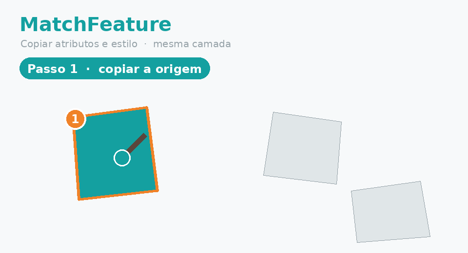

# MatchFeature — QGIS 3 plugin

Copy **attributes + visual style** from one feature to one or more features
**within the same layer**, in two steps (inspired by AutoCAD's `MATCHPROP`).

*Idea & design: **Hugo P. Teixeira** · Built with **Emergent** · Contact: texfap@gmail.com*




## What it does

Two-step workflow ("match properties"):

1. Select **exactly 1 source feature** and click the **MatchFeature** button →
   its properties are **copied** (a green message confirms how many fields).
2. Select **1 or more target features** and click the button **again** → the
   copied properties are **applied** to the targets. The source is then cleared.

- **Attributes**: copies every editable field, **skipping** identifier /
  auto-increment columns (`fid`, `id`, `id1`, `gid`, `objectid`, `*_id`, …) and
  read-only fields.
- **Style**: for *Categorized / Graduated* renderers the classification
  attribute is copied, so the target inherits the source symbol; *Single
  Symbol* is shared by the whole layer (nothing to do).
- **Fault tolerant**: incompatible fields are skipped silently (reported as a
  warning), the rest keep copying.
- **Undo/Redo**: the apply step is wrapped in `beginEditCommand`/`endEditCommand`,
  so a single `Ctrl+Z` reverts the whole operation.
- Works with **point, line and polygon** layers.

> Why two steps? In QGIS the selection is an unordered *set*, so there is no
> reliable "first selected" feature. The explicit copy-then-apply flow removes
> any ambiguity about which feature is the source.

## Validations & feedback (QGIS message bar)

| Situation | Message | Level |
|-----------|---------|-------|
| Source copied | `Source copied (N field(s))…` | Success (green) |
| Properties applied | `Properties applied to N feature(s)` | Success |
| Layer not in edit mode | `Layer is not in edit mode…` | Warning (yellow) |
| Wrong selection | `Step 1/2: select …` | Warning |
| Write error | `Error: …` | Critical (red) |

## Project layout

```
matchfeature/
├── __init__.py             # classFactory entry point
├── matchfeature.py         # plugin class: toolbar button, menu, validation
├── matchfeature_core.py    # pure copy logic (attributes + style)
├── metadata.txt            # name MatchFeature, version, QGIS >= 3.22, Qt6
├── icon.png                # toolbar icon (brush + layers + copy arrow)
├── resources.qrc           # icon resource (icon also loaded by path)
└── LICENSE                 # GPL v2
```

## Installation

### From ZIP (recommended)
1. Build the zip (see below) or download `matchfeature.zip`.
2. In QGIS: *Plugins ▸ Manage and Install Plugins… ▸ Install from ZIP*.
3. Select the zip and click **Install Plugin**.

### Manual
Copy the `matchfeature/` folder into your QGIS plugins directory:
- Linux: `~/.local/share/QGIS/QGIS3/profiles/default/python/plugins/`
- Windows: `%APPDATA%\QGIS\QGIS3\profiles\default\python\plugins\`
- macOS: `~/Library/Application Support/QGIS/QGIS3/profiles/default/python/plugins/`

Then enable **MatchFeature** in the Plugin Manager.

## Compatibility

- QGIS **3.22+** (tested target **3.34 LTR**), Qt5 **and** Qt6
  (`supportsQt6=True`). Qt is imported through `qgis.PyQt`, so it works on both
  bindings. The icon is loaded from disk, so no `pyrcc` step is required.

## Build the distributable ZIP
From the repository root:
```bash
zip -r matchfeature.zip matchfeature -x '*.pyc' -x '*__pycache__*'
```
The zip must contain the top-level `matchfeature/` folder with `metadata.txt`.

## Tests

The core logic is decoupled from QGIS and unit-tested with lightweight mocks
(`tests/mock_qgis.py`) — no QGIS install required:

```bash
python3 -m pytest tests/ -v
```

## Roadmap

- Copy across different layers with field mapping
- Options dialog (attributes only / style only / both) + per-field checkboxes
- Configurable keyboard shortcut
- Interactive map tool (click source, then click each target on the canvas)
- Translations (PT-PT, PT-BR, EN, ES)
- Submission to plugins.qgis.org

## Credits & license

- **Idea & design:** Hugo P. Teixeira (texfap@gmail.com)
- **Development:** Emergent
- License: **GPL v2+** (`matchfeature/LICENSE`). Shared with the QGIS community.
